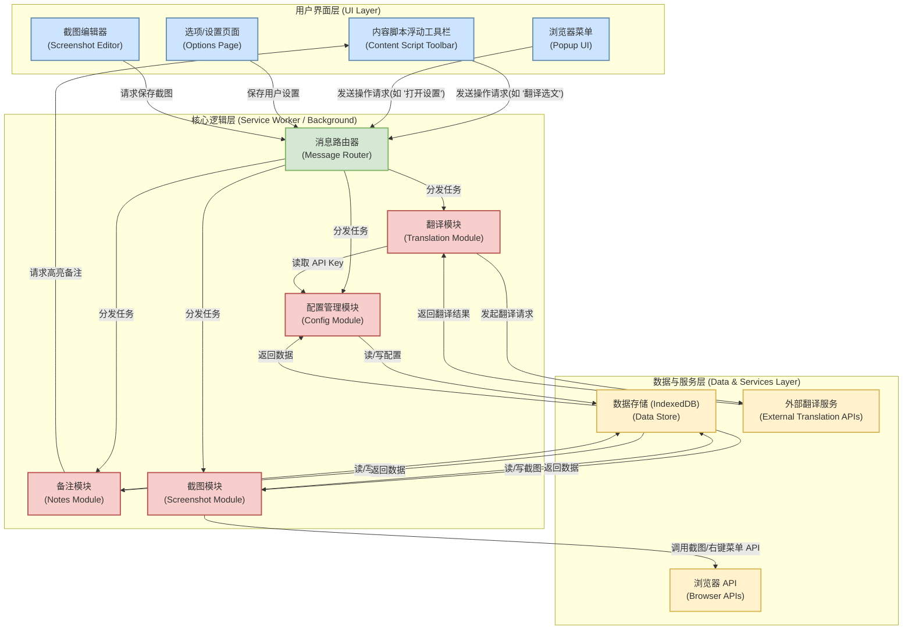

```mermaid
graph TD;
    subgraph "用户界面层 (UI Layer)"
        A["内容脚本浮动工具栏<br/>(Content Script Toolbar)"]
        B["浏览器菜单<br/>(Popup UI)"]
        C["选项/设置页面<br/>(Options Page)"]
        D["截图编辑器<br/>(Screenshot Editor)"]
    end

    subgraph "核心逻辑层 (Service Worker / Background)"
        E["消息路由器<br/>(Message Router)"]
        F["翻译模块<br/>(Translation Module)"]
        G["备注模块<br/>(Notes Module)"]
        H["截图模块<br/>(Screenshot Module)"]
        I["配置管理模块<br/>(Config Module)"]
    end

    subgraph "数据与服务层 (Data & Services Layer)"
        J["数据存储 (IndexedDB)<br/>(Data Store)"]
        K["浏览器 API<br/>(Browser APIs)"]
        L["外部翻译服务<br/>(External Translation APIs)"]
    end

    %% -- Connections --
    A -- "发送操作请求(如 '翻译选文')" --> E;
    B -- "发送操作请求(如 '打开设置')" --> E;
    C -- "保存用户设置" --> E;
    D -- "请求保存截图" --> E;

    E -- "分发任务" --> F;
    E -- "分发任务" --> G;
    E -- "分发任务" --> H;
    E -- "分发任务" --> I;

    F -- "发起翻译请求" --> L;
    F -- "读取 API Key" --> I;
    G -- "读/写备注" --> J;
    H -- "读/写截图" --> J;
    H -- "调用截图/右键菜单 API" --> K;
    I -- "读/写配置" --> J;

    L -- "返回翻译结果" --> F;
    J -- "返回数据" --> G;
    J -- "返回数据" --> H;
    J -- "返回数据" --> I;

    G -- "请求高亮备注" --> A;

    style A fill:#cde4ff,stroke:#6a8eae,stroke-width:2px;
    style B fill:#cde4ff,stroke:#6a8eae,stroke-width:2px;
    style C fill:#cde4ff,stroke:#6a8eae,stroke-width:2px;
    style D fill:#cde4ff,stroke:#6a8eae,stroke-width:2px;

    style E fill:#d5e8d4,stroke:#82b366,stroke-width:2px;
    style F fill:#f8cecc,stroke:#b85450,stroke-width:2px;
    style G fill:#f8cecc,stroke:#b85450,stroke-width:2px;
    style H fill:#f8cecc,stroke:#b85450,stroke-width:2px;
    style I fill:#f8cecc,stroke:#b85450,stroke-width:2px;

    style J fill:#fff2cc,stroke:#d6b656,stroke-width:2px;
    style K fill:#fff2cc,stroke:#d6b656,stroke-width:2px;
    style L fill:#fff2cc,stroke:#d6b656,stroke-width:2px;
```