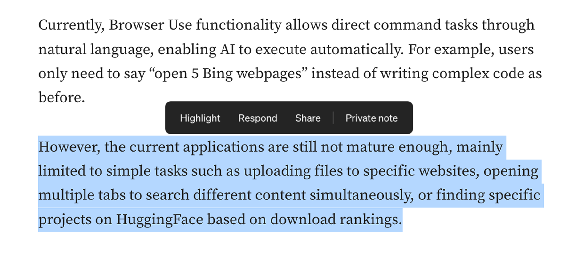
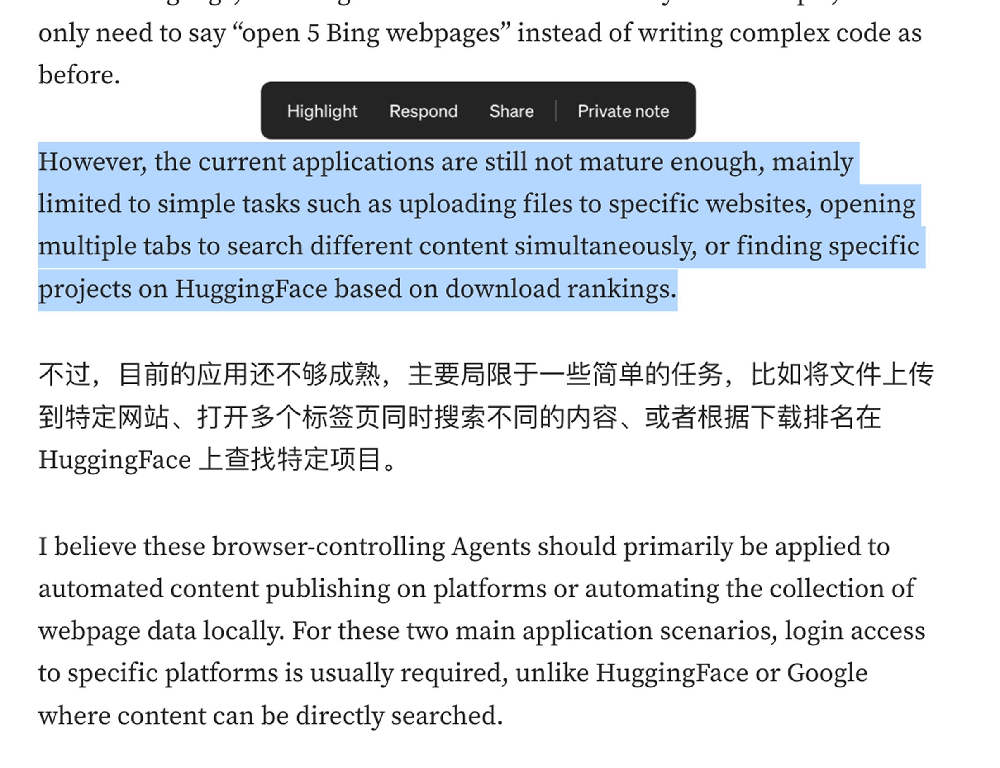
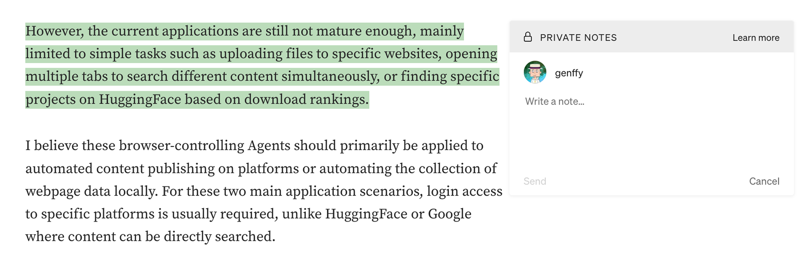
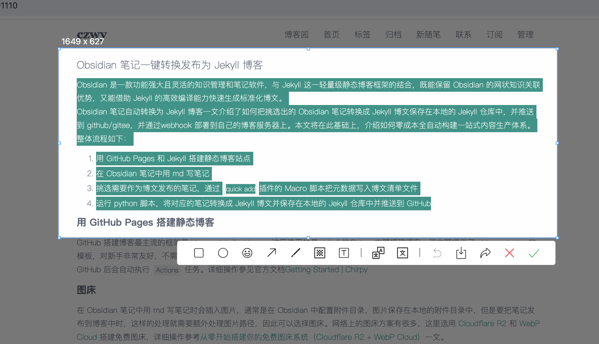

基于 [WXT](https://wxt.dev/) 框架开发的 chrome 插件
content script 核心功能如下：
## 选词
对网页内容进行选择后，出现选项（可以自定义显示位置），参考

### 翻译
翻译选中的文本，翻译结果显示在选中文本的正下方，需要考虑选中的不是完整段落，或者仅仅是一个单词的边界情，参考

### 备注
对选中的文本进行摘要，对其进行评论，且对于这部分数据有持久化的需求，需要考虑回显（特别是摘要的文章可能被修改的情况）参考

### 分享
参见[截图](##截图)部分

## 截图
快捷键截图功能（需要添加到右键菜单中），用户自己设置快捷键，需要避免和系统中其他软件快捷键冲突。

对用户选中的区域扩大区域生成照片转化成画板模式，可以对该照片进行二次编辑，比如马赛克、画笔标注等，然后分享渠道包括下载到本地、分享到推特、加入到收藏等。参考
