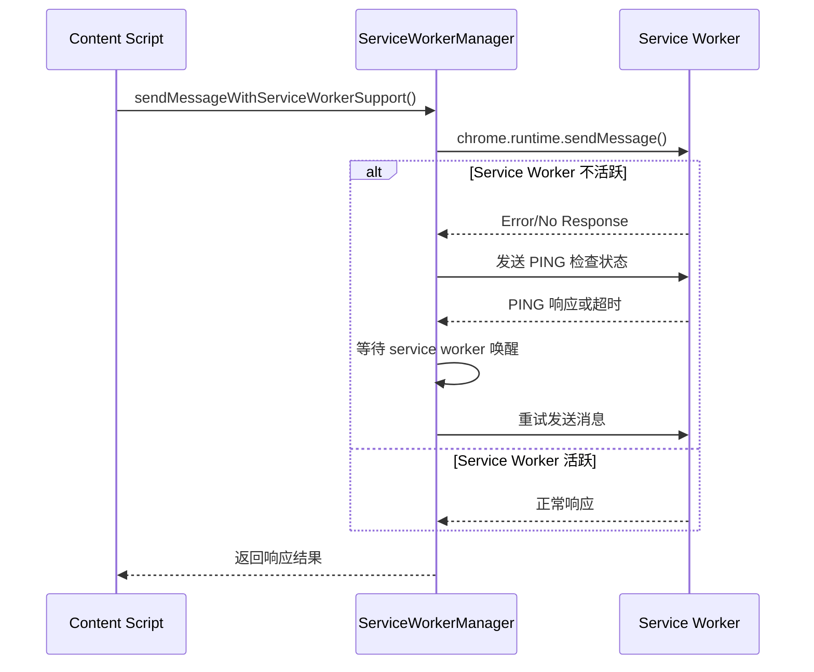
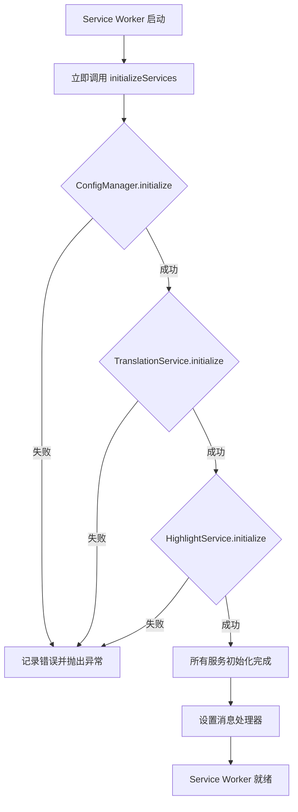

# Manifest V3 Service Worker 可用性指南

在 Chrome 扩展 Manifest V3 中，background script 运行在 service worker 中，不再是常驻的。这意味着 service worker 会在不活跃时被终止，并在需要时重新唤醒。本指南介绍了如何确保 content script 发送消息时 background script 处于可用状态。

## 核心问题

- **Service Worker 生命周期**: Service worker 不是常驻的，Chrome 会在不活跃时终止它们
- **消息发送失败**: 如果 service worker 处于非活跃状态，content script 的消息可能会失败
- **服务初始化**: Service worker 重新唤醒后，需要重新初始化各种服务

## 解决方案概述

我们的解决方案包含以下几个关键组件：

### 1. 自动唤醒机制

Chrome 会在收到 `chrome.runtime.sendMessage` 时自动唤醒 service worker，但我们需要确保服务正确初始化。

### 2. 改进的消息发送机制

#### 基础重试机制 (`MessageUtils.sendMessage`)

```typescript
// 基础重试，带指数退避
const response = await MessageUtils.sendMessage(message, 3) // 重试3次
```

#### 高级服务工作器支持 (`MessageUtils.sendMessageWithServiceWorkerSupport`)

```typescript
// 推荐使用：包含 service worker 检测、等待机制和超时控制
const response = await MessageUtils.sendMessageWithServiceWorkerSupport(message, {
  maxRetries: 3,
  retryDelay: 1000,
  timeout: 10000,  // 10秒超时
  waitForServiceWorker: true
})
```

### 3. Background Script 改进

#### 立即初始化服务

```typescript
// 在 service worker 启动时立即初始化所有服务
initializeServices().catch(error => {
  Logger.error('Failed to initialize services on startup:', error)
})
```

#### 增强的 PING 消息处理

```typescript
// 添加增强的 PING 处理器，返回详细的服务状态信息
browser.runtime.onMessage.addListener((message, sender, sendResponse) => {
  if (message.type === 'PING') {
    sendResponse({ 
      success: true,
      status: serviceContext.status,
      initialized: serviceContext.initialized,
      version: serviceContext.version,
      uptime: Date.now() - serviceContext.startupTime,
      services: { ...serviceContext.services },
      timestamp: Date.now()
    })
    return true
  }
})
```

### 4. Service Worker 管理器

#### 状态检测

```typescript
import { ServiceWorkerManager } from '../utils/service-worker-manager'
import { ServiceContext } from '../utils/service-context'

const manager = ServiceWorkerManager.getInstance()
const serviceContext = ServiceContext.getInstance()

// 检查 service worker 是否活跃
const isAlive = await manager.isServiceWorkerAlive()

// 获取详细状态（包含运行时长、版本等）
const status = await manager.getStatus()

// 获取服务初始化状态
const serviceStatus = serviceContext.getDetailedStatus()
console.log('Service status:', serviceStatus.status)
console.log('Uptime:', serviceStatus.uptime, 'ms')
console.log('Version:', serviceStatus.version)
```

#### 智能消息发送

```typescript
// 自动处理 service worker 唤醒
const response = await manager.sendMessageWithRetry(message, {
  maxRetries: 3,
  retryDelay: 1000,
  waitForServiceWorker: true
})
```

## 最佳实践

### 1. 消息发送

```typescript
// ✅ 推荐：使用增强的消息发送（包含超时控制）
const response = await MessageUtils.sendMessageWithServiceWorkerSupport({
  type: 'GET_HIGHLIGHTS',
  query: { limit: 10 }
}, {
  maxRetries: 3,
  retryDelay: 1000,
  timeout: 8000,  // 8秒超时，适合大部分场景
  waitForServiceWorker: true
})

// ⚠️ 可接受：基础重试机制
const response = await MessageUtils.sendMessage({
  type: 'GET_HIGHLIGHTS', 
  query: { limit: 10 }
}, 3)

// ❌ 不推荐：无重试机制
const response = await chrome.runtime.sendMessage(message)
```

### 2. 错误处理

```typescript
try {
  const response = await MessageUtils.sendMessageWithServiceWorkerSupport(message)
  
  if (!response.success) {
    console.error('Operation failed:', response.error)
    // 处理业务逻辑错误
  }
  
  return response.data
} catch (error) {
  console.error('Message sending failed:', error)
  // 处理网络/系统错误
}
```

### 3. 开发调试

```typescript
// 开启健康检查（仅开发环境）
if (process.env.NODE_ENV === 'development') {
  ServiceWorkerManager.getInstance().startHealthCheck(30000)
}

// 检查服务状态
const status = await MessageUtils.checkServiceWorkerStatus()
console.log('Service Worker Status:', status)
```

## 技术实现细节

### 重试策略

1. **指数退避**: 重试间隔逐渐增加 (1s, 2s, 4s, 最大5s)
2. **最大重试次数**: 默认 3 次，可配置
3. **超时控制**: 默认 10 秒超时，防止无限等待
4. **Service Worker 等待**: 检测并等待 service worker 唤醒
5. **故障快速检测**: 使用 PING 机制快速检测 SW 状态

### 消息流程



### 服务初始化流程



## 故障排除

### 常见问题

1. **消息发送失败**: 使用带重试机制的消息发送方法
2. **Service Worker 频繁重启**: 这是正常行为，确保服务能快速重新初始化
3. **初始化失败**: 检查各个服务的依赖和存储权限
4. **消息超时**: 调整 `timeout` 参数，某些操作（如大量数据处理）可能需要更长时间
5. **断网场景**: 消息失败可能不是 Service Worker 问题，检查网络连接状态
6. **权限问题**: 确认扩展具有必要的权限（storage、activeTab 等）
7. **Content Script 阻塞**: 页面脚本错误可能影响 content script 的消息发送能力

### 非 Service Worker 原因的消息失败

消息通信失败不一定是 Service Worker 生命周期导致的，可能的原因包括：

- **网络连接问题**: 用户断网或网络不稳定
- **Content Script 环境**: 页面错误导致 content script 无法正常运行
- **浏览器资源限制**: 内存不足或 CPU 负载过高
- **扩展权限缺失**: 缺少必要的 manifest 权限声明
- **页面安全策略**: CSP 或其他安全策略阻止脚本执行
- **扩展被禁用**: 用户在扩展管理界面暂时禁用了扩展

#### 诊断建议

```typescript
// 1. 检查扩展是否可用
if (!chrome.runtime?.id) {
  console.error('Extension context is invalid')
  return
}

// 2. 检查网络状态（如果可用）
if (navigator.onLine === false) {
  console.warn('Network is offline')
}

// 3. 检查 Service Worker 状态
const swStatus = await MessageUtils.checkServiceWorkerStatus()
if (!swStatus.isAlive) {
  console.warn('Service Worker may not be responding')
}

// 4. 使用超时和错误处理
try {
  const response = await MessageUtils.sendMessageWithServiceWorkerSupport(message, {
    timeout: 5000,
    maxRetries: 2
  })
  // 处理响应
} catch (error) {
  if (error.message.includes('timeout')) {
    console.error('Operation timed out - may indicate service issues')
  } else if (error.message.includes('Extension context invalidated')) {
    console.error('Extension was reloaded or disabled')
  }
}
```

### 调试技巧

```typescript
// 1. 检查 service worker 状态
const status = await MessageUtils.checkServiceWorkerStatus()
console.log('SW Status:', status)

// 2. 监控消息发送
MessageUtils.sendMessageWithServiceWorkerSupport(message).then(response => {
  console.log('Message response:', response)
}).catch(error => {
  console.error('Message failed:', error)
})

// 3. 启用详细日志
// 在 background script 中查看 Logger 输出
```

## 总结

通过实施这些改进，我们确保了：

- ✅ **自动 Service Worker 唤醒**: Chrome 会在消息发送时自动唤醒 service worker
- ✅ **快速服务初始化**: Service worker 启动后立即初始化所有必要服务  
- ✅ **智能重试机制**: 消息发送失败时自动重试，包含指数退避和超时控制
- ✅ **Service Worker 检测**: 能够检测和等待 service worker 变为活跃状态
- ✅ **统一状态管理**: 通过 ServiceContext 统一管理所有服务的状态和生命周期
- ✅ **增强的健康检查**: PING 机制返回详细的运行时状态（版本、运行时长等）
- ✅ **完善的生命周期处理**: 支持首次安装、版本更新、浏览器重启等场景
- ✅ **超时保护**: 防止消息发送无限等待，快速故障检测
- ✅ **健壮的错误处理**: 区分不同错误类型，提供详细的诊断信息
- ✅ **开发友好**: 提供调试工具、状态监控和错误诊断指南

### 🔧 新增核心功能

1. **ServiceContext 统一状态管理**: 集中管理服务初始化状态
2. **超时控制机制**: 消息发送支持可配置的超时时间
3. **增强的 PING 响应**: 包含版本、运行时长、详细状态等信息
4. **完整的生命周期管理**: 处理安装、更新、重启等所有场景
5. **故障诊断指南**: 帮助区分 Service Worker 问题和其他原因

这些改进确保了在 Manifest V3 环境下，content script 与 background script 之间的通信是**极其可靠和稳定的**，同时提供了**生产级别的错误处理和监控能力**。 