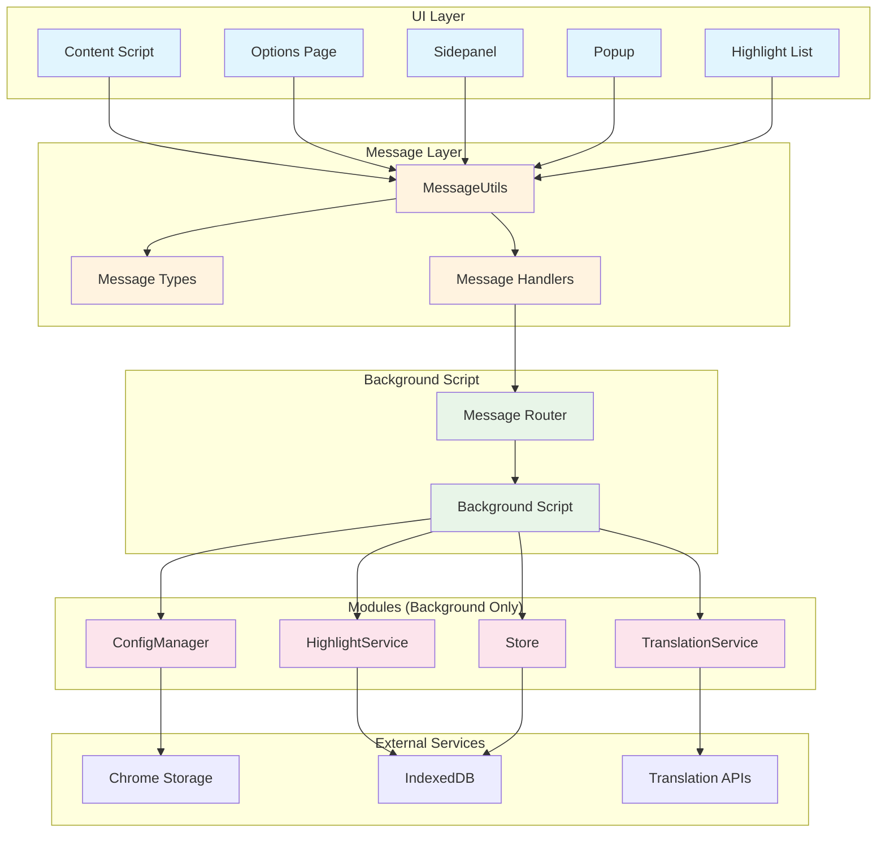

# Moudles
Those moudles only be used in background script.

## architecture

```mermaid
graph TD
    subgraph "UI Layer"
        A[Content Script]
        B[Options Page]
        C[Sidepanel]
        D[Popup]
        E[Highlight List]
    end
    
    subgraph "Message Layer"
        F[MessageUtils]
        G[Message Types]
        H[Message Handlers]
    end
    
    subgraph "Background Script"
        I[Background Script]
        J[Message Router]
    end
    
    subgraph "Modules (Background Only)"
        K[ConfigManager]
        L[TranslationService]
        M[HighlightService]
        N[Store]
    end
    
    subgraph "External Services"
        O[Chrome Storage]
        P[IndexedDB]
        Q[Translation APIs]
    end
    
    A --> F
    B --> F
    C --> F
    D --> F
    E --> F
    
    F --> G
    F --> H
    
    H --> J
    J --> I
    
    I --> K
    I --> L
    I --> M
    I --> N
    
    K --> O
    L --> Q
    M --> P
    N --> P
    
    style A fill:#e1f5fe
    style B fill:#e1f5fe
    style C fill:#e1f5fe
    style D fill:#e1f5fe
    style E fill:#e1f5fe
    style F fill:#fff3e0
    style G fill:#fff3e0
    style H fill:#fff3e0
    style I fill:#e8f5e8
    style J fill:#e8f5e8
    style K fill:#fce4ec
    style L fill:#fce4ec
    style M fill:#fce4ec
    style N fill:#fce4ec
```